# MTCLIPEncode 节点功能描述

## 在 `CLIPTextEncode` 节点中使用母语（`MarianMT` 翻译）输入，并用 `Ollama` 强化提示词

*有诗为证*：

```打油诗
MTCLIPEncode
　　　　　　　　〔mark〕
Krita，Diffusion，        # -sion
英文咒语最为准。            # 准
扩散增益 Ollama，          # -ma （变韵）
母语生图 convenient。      # -ient
```
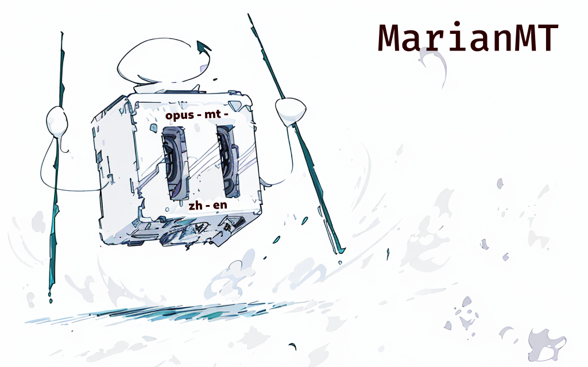

**▲ MarianMT ── 丰富、稳定且见多识广的多语翻译模型**

> MTCLIPEncode：为 ComfyUI 中的 CLIPTextEncode 节点增加了多语翻译（MarianMT）和提示词强化（Ollama）功能，可以把你的母语输入译成英文提示词，还能使用进一步优化提示词质量，且支持 Krita AI Diffusion，轻松生成你想要的图像。

> MTCLIPEncode: An extension for ComfyUI's CLIPTextEncode node, offering multilingual translation (using MarianMT) and prompt enhancement (using Ollama). Seamlessly translate your native language prompts into English and further optimize them for generating your desired images with Stable Diffusion. Supports Krita AI Diffusion.

> MTCLIPEncode: เพิ่มฟังก์ชั่นการแปลหลายภาษา (MarianMT) และการปรับปรุงพรอมต์ (Ollama) ให้กับโหนด CLIPTextEncode ใน ComfyUI ช่วยให้คุณแปลข้อความพรอมต์จากภาษาแม่เป็นภาษาอังกฤษ และปรับปรุงคุณภาพของพรอมต์ได้อย่างง่ายดาย รองรับ Krita AI Diffusion สร้างภาพที่คุณต้องการได้อย่างง่ายดาย

> MTCLIPEncode: Расширение для узла CLIPTextEncode в ComfyUI, добавляющее многоязычный перевод (с помощью MarianMT) и улучшение подсказок (с помощью Ollama). Легко переводите свои подсказки с родного языка на английский и дополнительно оптимизируйте их для генерации желаемых изображений с помощью Stable Diffusion. Поддерживает Krita AI Diffusion.

> MTCLIPEncodeは、ComfyUIのCLIPTextEncodeノードを拡張し、多言語翻訳（MarianMT）とプロンプト強化（Ollama）機能を追加します。あなたの母国語のプロンプトを英語に翻訳し、Stable Diffusionで理想の画像を生成するためにさらに最適化できます。Krita AI Diffusionにも対応しています。

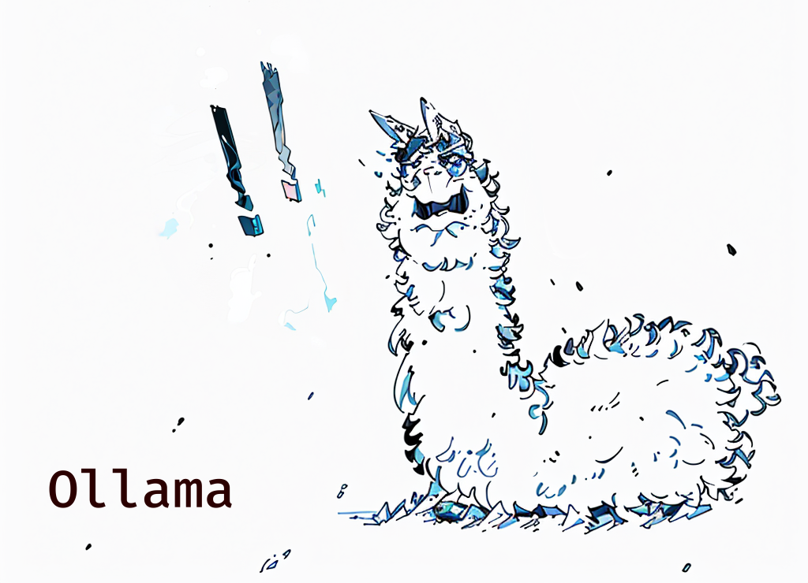

**▲ Ollama ── 聪明、灵活且野性难驯的大语言模型**

> MTCLIPEncode : Une extension pour le nœud CLIPTextEncode de ComfyUI offrant une traduction multilingue (grâce à MarianMT) et une amélioration des invites (grâce à Ollama). Traduisez facilement vos invites dans votre langue maternelle en anglais et optimisez-les pour générer les images que vous souhaitez avec Stable Diffusion. Compatible avec Krita AI Diffusion.

> MTCLIPEncode: Eine Erweiterung für den CLIPTextEncode-Knoten in ComfyUI, die mehrsprachige Übersetzung (mit MarianMT) und Prompt-Verbesserung (mit Ollama) bietet. Übersetzen Sie Ihre Eingaben mühelos aus Ihrer Muttersprache ins Englische und optimieren Sie sie weiter, um mit Stable Diffusion die gewünschten Bilder zu erzeugen. Unterstützt Krita AI Diffusion.

> MTCLIPEncode: Una extensión para el nodo CLIPTextEncode de ComfyUI que agrega traducción multilingüe (usando MarianMT) y mejora de prompts (usando Ollama). Traduce sin problemas tus prompts de tu idioma nativo al inglés y optimízalos aún más para generar las imágenes que deseas con Stable Diffusion. Es compatible con Krita AI Diffusion.

> MTCLIPEncode: ComfyUI의 CLIPTextEncode 노드에 다국어 번역(MarianMT) 및 프롬프트 강화(Ollama) 기능을 추가했습니다. 모국어로 입력한 프롬프트를 영어로 번역하고, Ollama를 사용하여 프롬프트 품질을 더욱 향상시킬 수 있습니다. Krita AI Diffusion을 지원하여 원하는 이미지를 쉽게 생성할 수 있습니다.

> MTCLIPEncode: यह ComfyUI के CLIPTextEncode नोड के लिए एक विस्तार है जो बहुभाषी अनुवाद (MarianMT का उपयोग करके) और प्रॉम्प्ट संवर्धन (Ollama का उपयोग करके) प्रदान करता है। आप आसानी से अपनी मूल भाषा के प्रॉम्प्ट को अंग्रेजी में अनुवाद कर सकते हैं और Stable Diffusion के साथ अपनी इच्छित छवियों को उत्पन्न करने के लिए उन्हें और बेहतर बना सकते हैं। Krita AI Diffusion के साथ संगत है।

## 一图胜过千言（后文太长不看）

*此图若能读懂，后续说明可不必再看。*

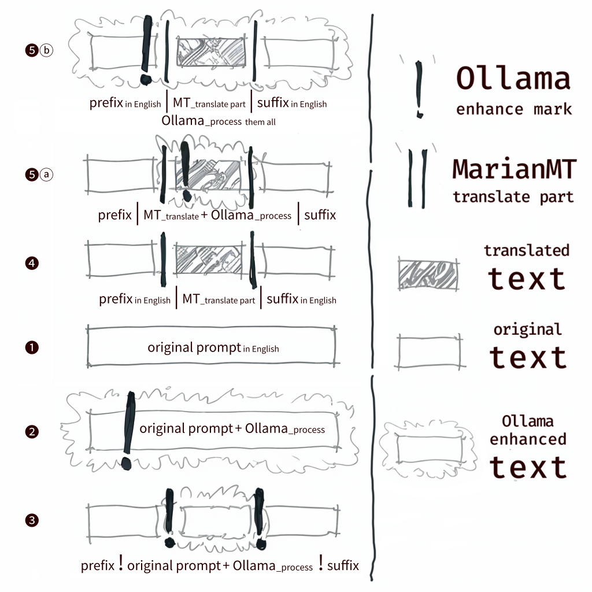

**▲ 用图例，表示 `MarianMT` 翻译与 `Ollama` 优化的组合结果**

## 上图若未能领会，下表将举例说明：

*此表若能读懂，后续说明可不必再看。*

<table>
    <colgroup>
    <col span="1">
    <col span="1" style="background-color: grey">
  </colgroup>
  <tr>
    <th style="background-color:darkgrey">用户输入</th>
    <th rowspan="2" style="width:2%">序<br>号</th>
    <th rowspan="2" style="width:12%">符号组合</th>
    <th rowspan="2" style="width:10%">Ollama<br>作用范围</th>
    <th rowspan="2" style="width:8%">MarianMT<br>作用范围</th>
    <th rowspan="2" style="width:12%">备注</th>
  </tr>
  <tr>
    <th>处理结果</td>
  </tr>
    <tr>
    <td style="background-color:darkgrey"><span style="font-size: 28px;">!</span> &lt;lora:tekakutli-kiki-v10:0.7&gt;, krita-kiki, <span style="font-size: 28px;">|</span>活泼的女孩，本体为松鼠的拟人化形像，<span style="font-size: 28px;">|</span> solo, vibrant colors, perfect hands</td>
    <td rowspan="2">❺<br>ⓑ
    <td rowspan="2">有`||`，<br>有一个`!`，<br>`!`在`||`外</td>
    <td rowspan="2">前缀<br>+翻译结果<br>+后缀</td>
    <td rowspan="2">`<span style="font-size: 28px;">|</span><span style="font-size: 28px;">|</span>`之间</td>
    <td rowspan="2">MarianMT 翻译，<br>前、后缀合并，<br>然后 Ollama 将优化整条提示词<br>（前、后缀的固定格式会被 Ollama 破坏）</td>
  </tr>
  <tr>
    <td><span style="background-color: lightyellow;">Lora Tekakutli-Kiki V10 at strength 0.7 + Krita Kiki aesthetic, focus on a vibrant humanized squirrel girl in solo composition, alive with motion and expressive personality, hands crafted with perfect detail, illuminated by warm, golden light, positioned following the rule of thirds for dynamic balance, set against a lush, verdant forest bursting with life, evoking a sense of playful freedom and harmony with nature</span></td>
  </tr>
    <tr>
    <td style="background-color:darkgrey">&lt;lora:tekakutli-kiki-v10:0.7&gt;, krita-kiki, <span style="font-size: 28px;">|</span><span style="font-size: 28px;">!</span> 活泼的女孩，本体为松鼠的拟人化形像，<span style="font-size: 28px;">|</span> solo, vibrant colors, perfect hands</td>
    <td rowspan="2">❺<br>ⓐ
    <td rowspan="2">有`||`，<br>有一个`!`，<br>`!`在`||`内</td>
    <td rowspan="2">仅针对<br>翻译结果</td>
    <td rowspan="2">`<span style="font-size: 28px;">|</span><span style="font-size: 28px;">|</span>`之间</td>
    <td rowspan="2">MarianMT 翻译，<br>Ollama 优化，<br>然后再合并前、后缀<br>（前、后缀会保持原样）</td>
  </tr>
  <tr>
    <td>&lt;lora:tekakutli-kiki-v10:0.7&gt;, krita-kiki, <span style="background-color: lightyellow;">lively humanized squirrel girl, playful expression, bushy tail twirling like a pennant, vibrant fur patterns, expressive human-like eyes, set in a lush, sun-dappled forest, impressionistic style with visible brushstrokes, shallow depth of field to focus on the girl and her immediate environment, warm golden lighting creating a radiant, inviting atmosphere,</span> solo, vibrant colors, perfect hands</td>
  </tr>
    <tr>
    <td style="background-color:darkgrey">&lt;lora:tekakutli-kiki-v10:0.7&gt;, krita-kiki, <span style="font-size: 28px;">|</span>活泼的女孩，本体为松鼠的拟人化形像，<span style="font-size: 28px;">|</span> solo, vibrant colors, perfect hands</td>
    <td rowspan="2">❹
    <td rowspan="2">仅有`||`，<br>无`!`</td>
    <td rowspan="2">-</td>
    <td rowspan="2">`<span style="font-size: 28px;">|</span><span style="font-size: 28px;">|</span>`之间</td>
    <td rowspan="2">仅翻译，双竖线界定 MarianMT 模型的翻译范围</td>
  </tr>
  <tr>
    <td>&lt;lora:tekakutli-kiki-v10:0.7&gt;, krita-kiki, <span style="background-color: lightyellow;">The lively girl, the body of a humanized squirrel,</span> solo, vibrant colors, perfect hands</td>
  </tr>
  <tr>
    <td style="background-color:darkgrey">&lt;lora:tekakutli-kiki-v10:0.7&gt;, krita-kiki, lively squirrel girl, solo, masterpiece, high detail, vibrant colors, perfect hands</td>
    <td rowspan="2">❶
    <td rowspan="2">无`||`，<br>无`!`</td>
    <td rowspan="2">-</td>
    <td rowspan="2">-</td>
    <td rowspan="2">输入文本将直接进入 CLIP 编码流程，<br>与默认的 `CLIPTextEncode` 节点无异</td>
  </tr>
  <tr>
    <td>&lt;lora:tekakutli-kiki-v10:0.7&gt;, krita-kiki, lively squirrel girl, solo, masterpiece, high detail, vibrant colors, perfect hands</td>
  </tr>
    <tr>
    <td style="background-color:darkgrey">&ltlora:tekakutli-kiki-v10:0.7&gt, krita-kiki, lively squirrel girl, solo, <span style="font-size: 28px;">!</span>masterpiece, high detail, vibrant colors, perfect hands</td>
    <td rowspan="2">❷
    <td rowspan="2">无`||`，<br>有一个`!`</td>
    <td rowspan="2">整个文本</td>
    <td rowspan="2">-</td>
    <td rowspan="2">无论`<span style="font-size: 28px;">!</span>`的位置在哪，都会调用 Ollama，进而“优化”掉所有文本</td>
  </tr>
  <tr>
    <td><span style="background-color: lightyellow;">vibrant squirrel girl in lively Krita-Kiki style, enhanced with Tekakutli-Kiki LoRA (0.7), solo masterpiece - high detail, dynamic composition following the golden ratio, rich vibrant colors evoking a lush autumnal atmosphere, perfect hands sculpted by the soft morning sunlight filtering through the canopy above, wide-angle shot emphasizing depth and immersive storytelling</span></td>
  </tr>
  <tr>
    <td style="background-color:darkgrey">&lt;lora:tekakutli-kiki-v10:0.7&gt;, krita-kiki,<span style="font-size: 28px;">!</span> lively squirrel girl, solo, masterpiece, high detail,<span style="font-size: 28px;">!</span> vibrant colors, perfect hands</td>
    <td rowspan="2">❸
    <td rowspan="2">无`||`，<br>有`!!`</td>
    <td rowspan="2">`<span style="font-size: 28px;">!</span><span style="font-size: 28px;">!</span>`之间</td>
    <td rowspan="2">-</td>
    <td rowspan="2">唯一使用两个感叹号的格式，目的是界定 Ollama 的优化范围</td>
  </tr>
  <tr>
    <td>&lt;lora:tekakutli-kiki-v10:0.7&gt;, krita-kiki, <span style="background-color: lightyellow;">lively squirrel girl, playful and energetic, leaping in mid-air, caught in a sunbeam, masterpiece-quality detail, impressionistic style with visible brush strokes, shallow depth of field to emphasize movement, set against a lush, verdant forest backdrop teeming with life, evoking a sense of joyous freedom and harmony with nature,</span> vibrant colors, perfect hands</td>
  </tr>
</table>

**▲ 用表格与实例，解释 `MarianMT` 翻译与 `Ollama` 优化的组合效果**

---

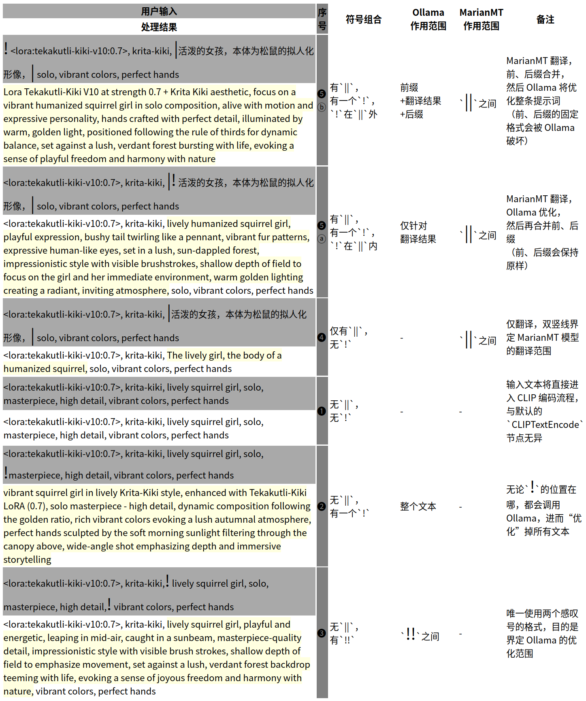

**▲ 用表格与实例（图片格式），解释 `MarianMT` 翻译与 `Ollama` 优化的组合效果**


**▲ krita-kiki 包含多种组合方式的简单工作流**

## 如果前面的图例和表格都没看懂，我会试着用人类的语言总结所有组合情况，提供另一种被理解的可能性：

1. 如果没有 `||`，也没有 `!`，就无需翻译，也无需 Ollama 优化，直接进入 CLIP 编码流程，跟默认的 `CLIPTextEncode` 无异；
2. 如果没有 `||`，说明无需翻译，但只有一个 `!`，且无论 `!` 在任何位置，Ollama 都会处理整个文本；
3. 如果没有 `||`，但有两个 `!`，表示 Ollama 将仅处理两个叹号 `!!` 中间的部分，前、后缀将保持不变，这是唯一会用到两个叹号的格式；
4. 如果仅有 `||`，没有 `!`，就只有翻译逻辑，且只翻译两个竖线 `||` 中间的部分；
5. 如果有 `||`，且有一个 `!`，则分两种情况：
   
    a. 一个 `!`在 `||` 范围内的任何位置，Ollama 在“合并前、后缀”之前起作用，仅仅处理翻译后的文本（之后再与前、后缀合并）；
    
    b.一个  `!`在 `||` 范围外的任何位置（无论在前缀中还是后缀中）Ollama 在“合并前、后缀”之后起作用，Ollama 会处理 `前缀+翻译好的文本+后缀` 。

# Q&A 与思路整理

## ◉ 为什么需要调用两个模型── `MarianMT` 翻译模型和 `Ollama` 语言模型？

`MarianMT` 模型很适合翻译工作，能保证稳定输出英文结果，极少出现“幻觉”（ *这对聪明的 `Ollama` 来说有些难度，准确地说，是 Ollama 中的某些模型在输出中文时以为自己在说英文，反之亦然* ）。

`Ollama` 负责优化提示词。见多识广、词汇丰富，能让文字描述更加生动、详尽，这是大语言模型的强项。

本节点的连接位置，与默认的 `CLIP Text Encode` 相同。

## ◉ 为什么使用“单一文字框”？
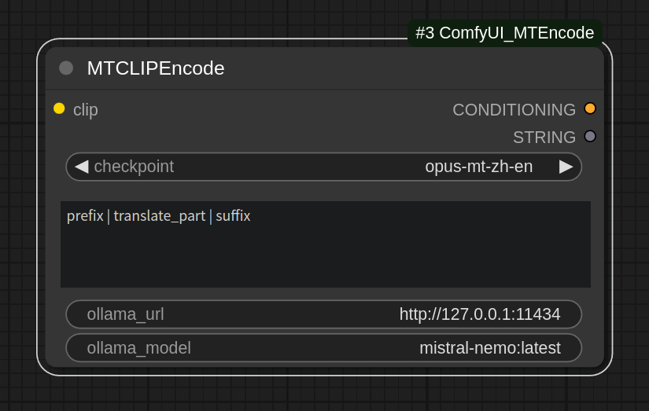

**▲ 单一文字框**

在 `ComfyUI` 中，我们会看到，`MTCLIPEncode` 节点仅有一个文字输入框。

这样做的好处是，可以用这里： [Optimized the prompt word module of the plugin](https://github.com/Acly/krita-ai-diffusion/discussions/867) @Darkosha405 提到的方法，串接在 `Krita AI Diffusion` 插件（感谢作者 @Acly ）中使用 ── **这也正是本节点的设计初衷**。

## ◉ 为什么需要约定文本格式

为了界定大模型的作用范围。

通常，当我们在使用 Stable Diffusion 时，为了让生成的图片更加符合我们的预期，有些提示词是需要固定不变的（如：lora、embedding、风格描述、取景方式、人物姿态、多人物组合方位……），有时哪怕一丁点儿修改，都会得到不可控的结果。

所以，我们需要在文本输入时做一些特别的约定，你可以理解为，这是某种特定的“语法”，正如前述说明中体现的那样 ── 这非常简单（哈哈哈，是吧）。

## ◉ 理解分界与作用范围：

### ● `||` 的分界示例。

---

**当仅使用 `MarianMT` 翻译模型时，约定的文本格式为：**

`prefix | translate_part | suffix`

**▲ 对应表格中的 ❹**

把需要翻译的部分夹在两道竖线 `||`中间，这样，提示词就分成了三个部分。

可简单理解为：

`prefix` ──“无需翻译的前缀”；

`translate_part` ──“需要翻译的提示词”；

`suffix` ──“无需翻译的后缀”。

如果提示词仅有 `| translate_part |`，没有前、后缀，也是可以的，但必须按照约定 ── 把要翻译的文字用两道竖线 `||`夹起来。

> 这样，就不会破坏 `Krita AI Diffusion` 插件中“风格设置”里预设的前、后缀提示词。

> 毕竟，在最初的最初，这个 `MTCLIPEncode` 节点就是为了在  `Krita AI Diffusion` 插件中使用而编写的（再次感谢作者 @Acly ！）。

---

### ● `!!` 的分界示例。

**当仅使用 `Ollama` 语言模型时，约定的文本格式为：**

`prefix ! Ollama_process ! suffix`

**▲ 对应表格中的 ❸**

把需要 Ollama 处理的部分夹在两个叹号 `!!`中间，这样，提示词就分成了三个部分。

可简单理解为：

`prefix` ──“无需 Ollama 处理的前缀”；

`Ollama_process` ──“需要 Ollama 处理的提示词”；

`suffix` ──“无需 Ollama 处理的后缀”。

如果提示词仅有 ` ! Ollama_process !`，没有前、后缀，也是可以的，但必须按照约定 ── 把需要 Ollama 处理的文字用两个叹号 `!!`夹起来。

---

### ● `!` 的作用范围比 `!!` 还大（或可表述为──分界消失了）

`prefix ! Ollama_process  suffix`

**▲ 对应表格中的 ❷**

---

### ● `||` 来分界，`!` 来锁定作用范围：

**`MarianMT` 翻译模型和 `Ollama` 强化模型合用，且 `Ollama` 仅作用于翻译部分。**
 
**此时，约定的文本格式为：**

`prefix |! translate_part | suffix`

**▲ 对应表格中的 ❺ⓐ**

`prefix !| translate_part | suffix` 等同于 `prefix | translate_part |! suffix`

**▲ 对应表格中的 ❺ⓑ**

---

## ◉ 终端里能看到的提示词处理过程

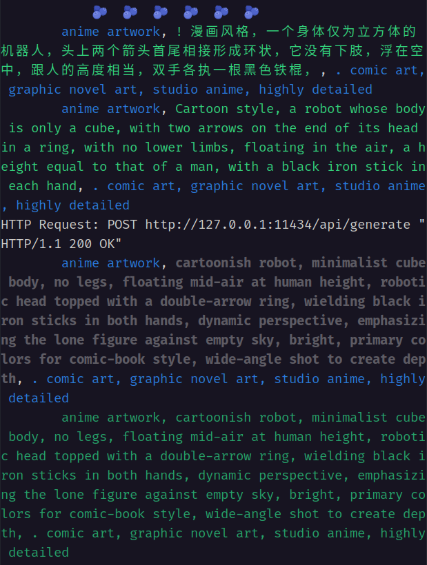

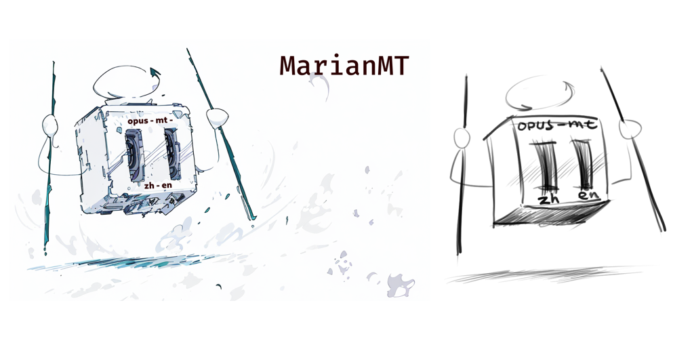

**▲ 前面 “MarianMT 翻译模型” 那张图的提示词处理过程**

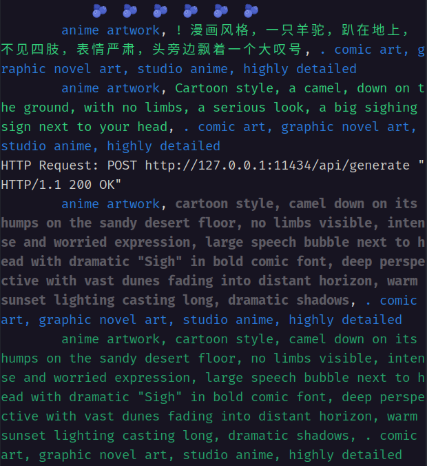

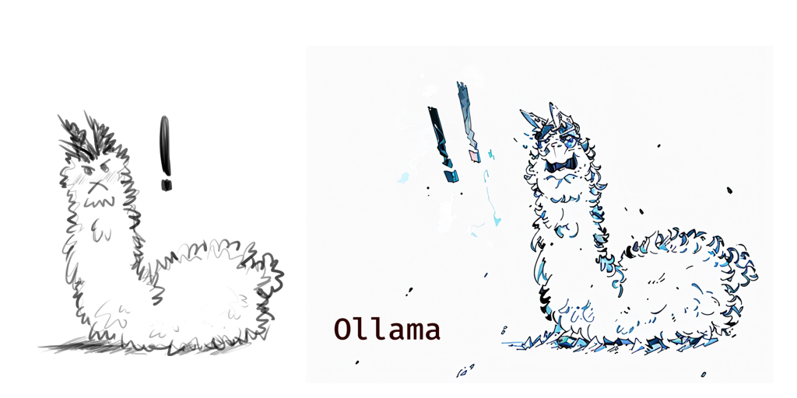

**▲ 前面 “Ollama 大语言模型” 那张图的提示词处理过程**

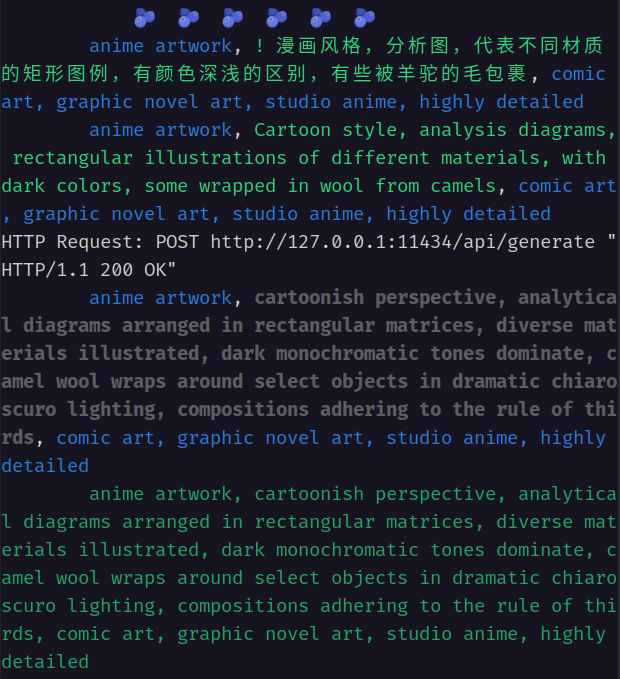

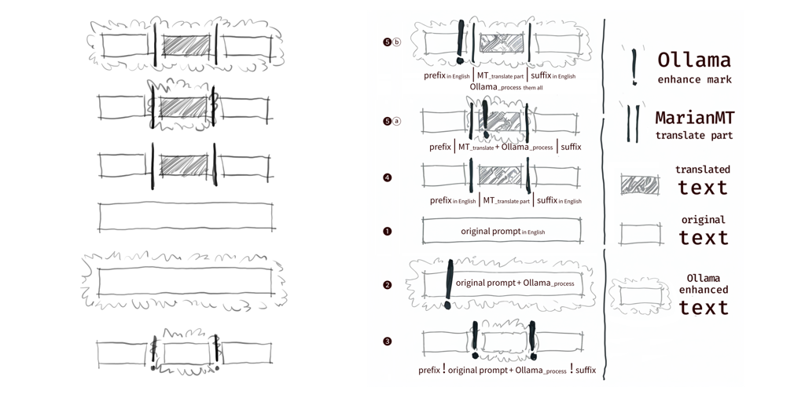

**▲ 前面 “图例与模型组合” 那张图的提示词处理过程**

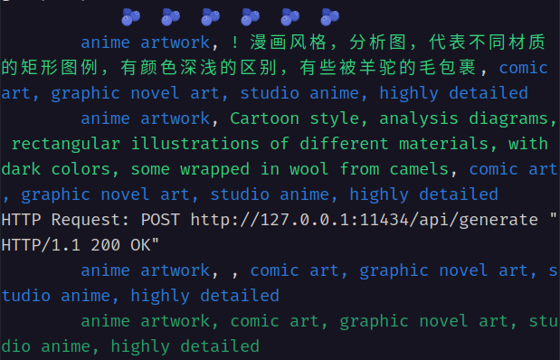

**▲ Ollama 模型有时会表现出不稳定的状态，时有返回空的结果的现象**

---

## ◉ 在 `nodes.py` 文件中添加更多语种列表：

```
marian_list = [
    "opus-mt-zh-en",
    "opus-mt-ru-en",
    "opus-mt-th-en",
    ......
]
# https://huggingface.co/Helsinki-NLP
# 在如上地址，可以找到更多语种的模型，
# 把状如 "opus-mt-th-en" 的模型名字添加到如上列表后，
# 下次使用时会自动下载模型，下载到哪里我也不知道，
# 实在想知道就去问 ChatGPT，代码几乎都是它写的。
```
## ◉ 若想在  `Krita AI Diffusion` 中使用本节点

**就要修改 `pykrita/ai_diffusion` 目录下的 `comfy_workflow.py` 文件（同时，安装本节点也是必须的，要不然呢……；），**

在 `comfy_workflow.py` 文件里，找到如下这行代码：

`        return self.add("CLIPTextEncode", 1, clip=clip, text=text)`

改为：

```
#        return self.add("CLIPTextEncode", 1, clip=clip, text=text)
        return self.add("MTCLIPEncode", 1, clip=clip, text=text, checkpoint="opus-mt-zh-en", ollama_url="http://127.0.0.1:11434", ollama_model="mistral-nemo:latest")
# "opus-mt-zh-en"，是中译英的模型，如果你用的是泰语，应该就是 "opus-mt-th-en"，
#     这个翻译模型的名字，一定、务必……要以 [huggingface](https://huggingface.co/Helsinki-NLP) 上查询的结果为准；
# "http://127.0.0.1:11434"，是 Ollama 的默认端口；
# "mistral-nemo:latest"，是 Ollama 模型的名字，
#     注意：有些模型会返回空信息，这里需要逐个测试才能得到满意的结果。
```
### 如上方法最初的来源，请详见这里： [Optimized the prompt word module of the plugin](https://github.com/Acly/krita-ai-diffusion/discussions/867) 

## ◉ 在 nodes.py 文件中修改驱使 Ollama 完成工作的提示词：

```
        prompt = f"""
You are a talented art director with a deep understanding of visual arts. You excel at transforming simple text descriptions into vivid, imaginative images. Now, you will be playing the role of a prompt engineer, providing precise and creative prompts for the Stable Diffusion model.

Please convert the following user input text: {text}, into a detailed and vivid prompt to inspire Stable Diffusion to generate a captivating image.

**Focus on:**
* **Clarity and precision:** Use clear and concise language that Stable Diffusion can easily understand.
* **Visual storytelling:** Create compelling narratives through your descriptions.
* **Artistic techniques:** Employ a variety of artistic techniques like lighting, composition, and perspective.
* **Style and atmosphere:** Convey the desired mood and style using vivid language and metaphors.

**Consider incorporating:**
* **Specific art styles:** e.g., impressionism, surrealism, cyberpunk
* **Cinematographic techniques:** e.g., shallow depth of field, wide-angle shot
* **Descriptive adjectives:** e.g., ethereal, luminous, brooding
* **Compositional elements:** e.g., rule of thirds, golden ratio

**Example:**
* **User input:** A lonely robot sitting on a distant planet
* **Your prompt:** # solitary android, desolate alien planet, distant star, panoramic view, sci-fi aesthetic, melancholic atmosphere, cinematic lighting #

**Remember:** Your goal is to create a prompt that inspires Stable Diffusion to generate a visually stunning and emotionally resonant image.

**Please enclose your prompt within two `#` symbols.**
"""
```

---

> 诚恳地说：<br>这里大部分代码都是 ChatGPT 写的，<br>Claude 和 Gemini 也都参与了修改。<br>其中： <br>Claude 精简掉了 “Ollama 模型列表的获取”步骤，Gemini 也认为每次获取这个列表是没有必要的，ChatGPT 也认同这一修改建议，表示直接“复制──粘贴”比较好。<br>Gemini 完成了如上“驱使 Ollama 稳定工作的提示词”的优化，让 Ollama 在大部分时间里都能较稳定地输出符合预期的结果。<br>几位 AI 老师为此节点的实现做出了极大贡献，特此感谢～<br>而我（mark──渺小到首字母都不好意思大写），只是个会写打油诗的小跟班儿（写 README.md 时学到了一点 Html 的表格技巧，这是我作为团队中唯一人类的一点小小收获）。

> 当我跟 Gemini 老师显摆我写的打油诗时，人家一口气给我甩回来好几篇。<br>比方如下这首，敲敲桌板就能唱起来：

```打油诗
扩散模型绘图，Stable Diffusion领先
英文提示词精准，Ollama优化深研
母语输入多便捷，创作乐趣大无边
```
